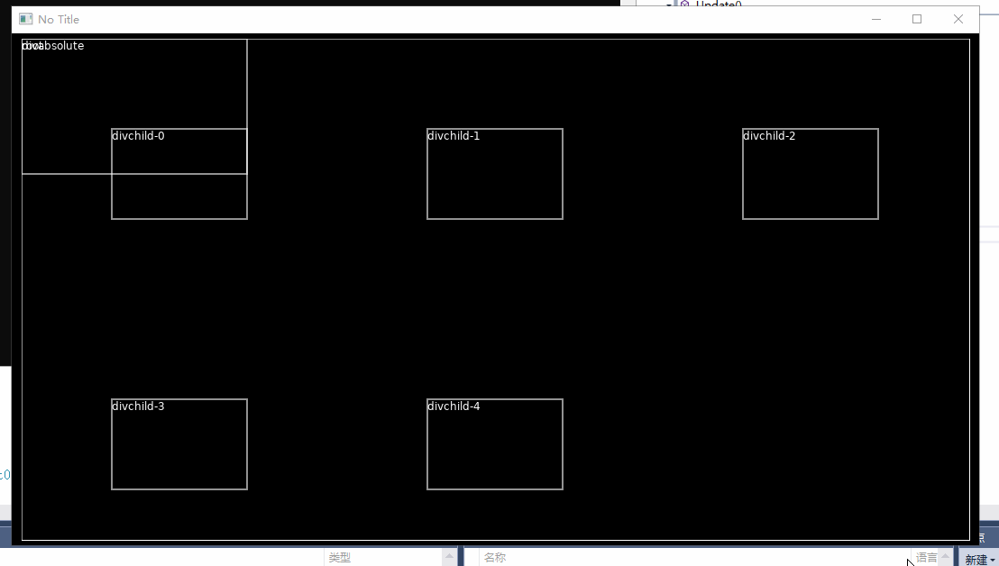

[](https://travis-ci.com/endlesstravel/Rockyfi)

# Rockyfi

C# implementation of [flexbox CSS](https://www.w3.org/TR/css-flexbox-1/) layout algorithm. Adapt from https://github.com/kjk/flex

Thanks [kjk/flex](https://github.com/kjk/flex), there is no such project without him.

Nuget Package [Rockyfi](https://www.nuget.org/packages/Rockyfi/) :

 `Install-Package Rockyfi`

## Status

* The implementation of flexlayout has been completed, all the test is passed.
* Support render XML to Flex Node tree is still on the way.
* Support [Love2dCS](https://github.com/endlesstravel/Love2dCS) is on the way.
* Unity3d support is a long-term goal.

## Usage

more example please check [test file](RockyfiTests/Rockyfi.test.cs)


```C#
var root = Flex.CreateDefaultNode();
root.StyleSetWidth(100);
root.StyleSetHeight(100);

var rootChild0 = Flex.CreateDefaultNode();
rootChild0.StyleSetPositionType(PositionType.Absolute);
rootChild0.StyleSetPosition(Edge.Start, 10);
rootChild0.StyleSetPosition(Edge.Top, 10);
rootChild0.StyleSetWidth(10);
rootChild0.StyleSetHeight(10);
root.InsertChild(rootChild0, 0);
Flex.CalculateLayout(root, float.NaN, float.NaN, Direction.LTR);

assertFloatEqual(0, root.LayoutGetLeft());
assertFloatEqual(0, root.LayoutGetTop());
assertFloatEqual(100, root.LayoutGetWidth());
assertFloatEqual(100, root.LayoutGetHeight());

assertFloatEqual(10, rootChild0.LayoutGetLeft());
assertFloatEqual(10, rootChild0.LayoutGetTop());
assertFloatEqual(10, rootChild0.LayoutGetWidth());
assertFloatEqual(10, rootChild0.LayoutGetHeight());

Console.WriteLine(NodePrinter.PrintToString(root));
```
output is:

```html
<div layout="width: 100; height: 100; top: 0; left: 0;" style="width: 100px; height: 100px; ">
  <div layout="width: 10; height: 10; top: 10; left: 10;" style="width: 10px; height: 10px; position: absolute; top: 10px; "></div>
</div>
```

## ShadowPlay Usage (beta?)


This is an example about [Love2dCS](https://github.com/endlesstravel/Love2dCS) support.



```C#
using Love;
using System.Collections.Generic;

namespace RockyfiFactory
{
    class SceneNormalXML: Scene
    {
        ShadowPlaySimple stage = new ShadowPlaySimple();
        public override void Load()
        {
            string tmpXML = @"
<div el-bind:width=""w"" el-bind:height=""h"" flex-wrap=""wrap"" justify-content=""center"" flex-direction=""row"" >
    <div el-for=""itemId in listData"" width=""150px"" height=""100px"" el-bind:id=""itemId""/>
</div>
";
            stage.Build(tmpXML, "listData", "w", "h");
            stage.SetData("listData", new List<string>
            {
                "child-0", "child-1", "child-2", "child-3", "child-4",
            });
            stage.SetData("w", "320px");
            stage.SetData("h", "320px");
            stage.Update();
            System.Console.WriteLine(stage.ToString());
        }

        public override void Update(float dt)
        {
            stage.SetData("w", $"{Graphics.GetWidth() - 200}px");
            stage.SetData("h", $"{Graphics.GetHeight() - 200}px");
            stage.Update();
        }

        public override void Draw()
        {
            Graphics.Translate(100, 100);
            Graphics.SetColor(Color.White);
            stage.Draw(0, 0, (x, y, w, h, text, attr) =>
            {
                Graphics.Rectangle(DrawMode.Line, x, y, w, h);
                Graphics.Print($"{(attr.TryGetValue("id", out object id) ? id : "")}", x, y);
            });
        }

        static void Main(string[] args)
        {
            Boot.Init(new BootConfig
            {
                WindowResizable = true,
            });
            Boot.Run(new SceneNormalXML());
        }
    }
}
```
support props, most attributes are covered in this [Guide](https://css-tricks.com/snippets/css/a-guide-to-flexbox/)

| name                  |default     |  example             |
----------------------- |------------|-----------------------
| overflow              | visible    |  visible / hidden / scroll |
| position              | relative   |  relative / absolute            |
| align-content         | auto       |  auto / flex-start / center / flex-end / stretch / baseline / space-between / space-around       |
| align-items           | auto       |  auto / flex-start / center / flex-end / stretch / baseline / space-between / space-around       |
| align-self            | auto       |  auto / flex-start / center / flex-end / stretch / baseline / space-between / space-around       |
| flex-direction        | column     |  column / column-reverse / row / row-reverse |
| flex-wrap             | no-wrap    |  no-wrap / wrap / wrap-reverse                    |
| flex-basis            | auto       |  15px / 30%          |
| flex                  | auto       |  5 / -3.2            |
| flex-shrink           | auto       |  5 / -3.2            |
| flex-grow             | auto       |  5 / -3.2            |
| justify-content       | flex-start |  flex-start / center / flex-end / space-between / space-around                    |
| direction             | inherit    |  inherit / ltr / rtl                    |
| width                 | auto       |  10 / 15px / 30% / auto         |
| height                | auto       |  10 / 15px / 30% / auto         |
| min-width             | auto       |  10 / 15px / 30% / auto         |
| min-height            | auto       |  10 / 15px / 30% / auto         |
| max-width             | auto       |  10 / 15px / 30% / auto         |
| max-height            | auto       |  10 / 15px / 30% / auto         |
| pos                   | auto       |  10 / 1px / 1px 2px 3px 4px / 2px 3px  / auto  |
| pos-left              | auto       |  10 / 15px / auto          |
| pos-right             | auto       |  10 / 15px / auto          |
| pos-top               | auto       |  10 / 15px / auto          |
| pos-bottom            | auto       |  10 / 15px / auto          |
| margin                | auto       |  10 / 1px / 1px 2px 3px 4px / 2px 3px  / auto   |
| margin-left           | auto       |  10 / 15px / auto          |
| margin-right          | auto       |  10 / 15px / auto          |
| margin-top            | auto       |  10 / 15px / auto          |
| margin-bottom         | auto       |  10 / 15px / auto          |
| padding               | auto       |  10 / 1px / 1px 2px 3px 4px / 2px 3px / auto   |
| padding-left          | auto       |  10 / 15px / auto          |
| padding-right         | auto       |  10 / 15px / auto          |
| padding-top           | auto       |  10 / 15px / auto          |
| padding-bottom        | auto       |  10 / 15px / auto          |
| border                | auto       |  10 / 1px / 1px 2px 3px 4px / 2px 3px / auto   |
| border-left           | auto       |  10 / 15px / auto           |
| border-right          | auto       |  10 / 15px / auto           |
| border-top            | auto       |  10 / 15px / auto           |
| border-bottom         | auto       |  10 / 15px / auto           |
<!-- | display               |  flex / none                 | -->


This `shadow play` is not mean [Shadow Play](https://www.nvidia.com/en-us/geforce/geforce-experience/shadowplay/) but [Shadow Play](https://en.wikipedia.org/wiki/Shadow_play)
